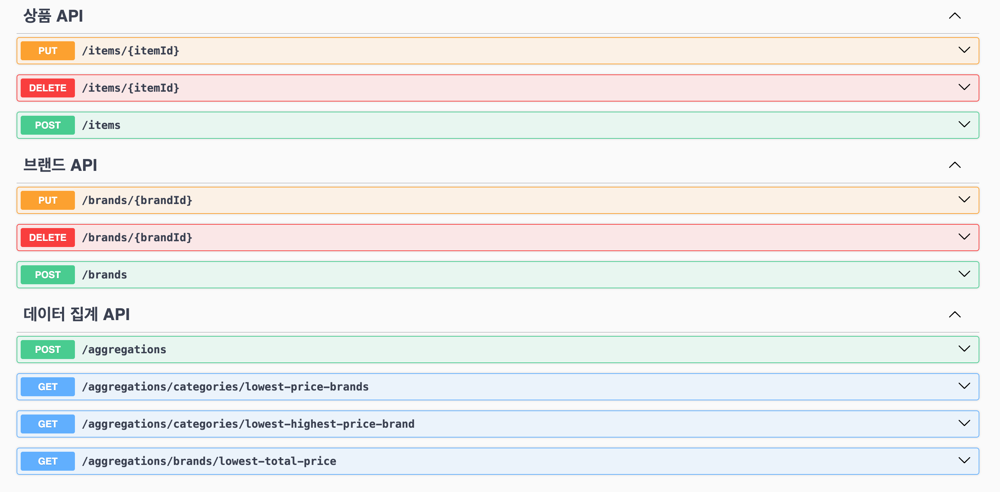

- [API 문서](#api-문서)
- [ERD](#erd)
- [실행 방법](#실행-방법)
- [테스트](#테스트)
- [개발 중 고민사항](#개발-중-고민사항)
  - [집계 데이터 생성 방식](#집계-데이터-생성-방식)
- [개선할 점](#개선할-점)

---

## API 문서

- 로컬에서 애플리케이션을 실행 후 http://localhost:8080/swagger-ui/index.html 로 접속하시면 API 문서를 확인하실 수 있습니다.



## ERD

- 상품, 브랜드, 카테고리 테이블과 최저가 정보의 원본 집계 데이터를 저장하는 4개의 테이블로 구성했습니다.
- 로컬에서 애플리케이션을 실행 후 http://localhost:8080/h2-console 로 접속하시면 H2 Console에 접근 하실 수 있습니다.
- 인메모리 경로: `jdbc:h2:mem:musinsa-db`


## 실행 방법

- 현재 프로젝트에서 EmbeddedRedis를 사용했는데, ARM 기반의 맥북에서는 의존성 추가만으로는 실행되지 않는 이슈가 있어 바이너리 파일을 `/src/main/resources/binary/redis` 경로에 위치하도록 했습니다.
  - 최초 실행 시 권한이 필요하다는 문구가 나올 수 있습니다. 다음의 방법으로 해결할 수 있습니다.
  - `Mac 환경설정` > `보안 및 개인 정보 보호` > `일반 탭` > 하단에 에러 문구가 뜨는데 `확인 없이 열기` 버튼 클릭
- SpringBoot3.0 이상 부터는 Java 버전이 17 이상만 지원 됩니다. 실행 전 Java 버전을 확인해주세요.

```bash
# 1. 빌드를 실행합니다.
./gradlew clean build

# 2. jar 파일을 실행합니다.
java -jar ./build/libs/assignment-0.0.1-SNAPSHOT.jar
```

## 테스트

- 총 56 개의 테스트를 작성하였습니다. (단위테스트 / 통합테스트)


- e2e test는 http client를 사용하여 작성했습니다.


## 개발 중 고민사항

### 집계 데이터 생성 방식

아래 2가지 방식을 고민하였고 최종적으로 **데이터에 변경이 발생할때 이벤트를 생성하여 집계 데이터를 업데이트하는 방식**을 선택했습니다.

- 1번: 스케줄러를 사용하여 일정 시간마다 캐시에 적재하는 집계 데이터를 새롭게 생성하는 방식
- 2번: 브랜드 혹은 상품 데이터에 변경이 발생할때 이벤트를 생성하여 실시간으로 집계 데이터를 업데이트하는 방식

실제 운영하는 서비스라면 브랜드와 상품 데이터에 변경이 발생하는 일이 빈번할것으로 예상하여 스케줄러 혹은 배치를 사용하여 일정 주기로 집계를 진행해야한다고 생각합니다.  
하지만 현재 과제에서는 브랜드와 상품 데이터에 변경이 자주 발생하지 않고, 변경 후 바로 데이터를 조회할 경우 실시간으로 변경된 데이터를 제공해야하는 요구사항을 충족하기 위해 2번 방식을 사용했습니다.

아래 그림은 api 콜이 발생했을때의 흐름입니다.


## 개선할 점

- 아웃박스 패턴을 사용하여 이벤트 처리에 실패해도 데이터 정합성 보장하도록 개선.
- TestContainers를 도입하여 테스트코드를 외부 의존성으로부터 격리.
- LocalCache 도입
